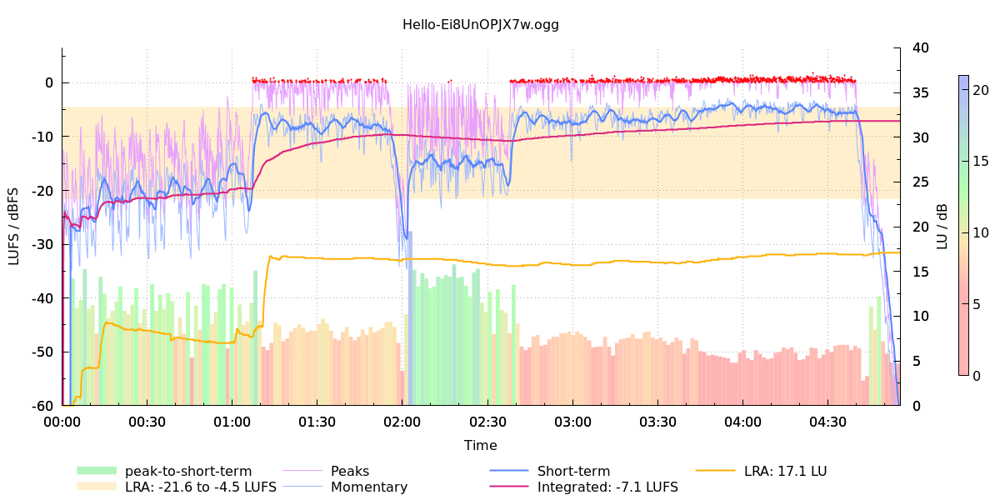
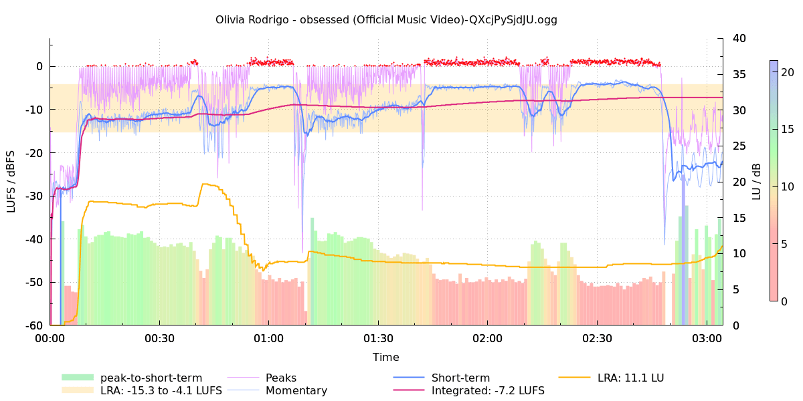
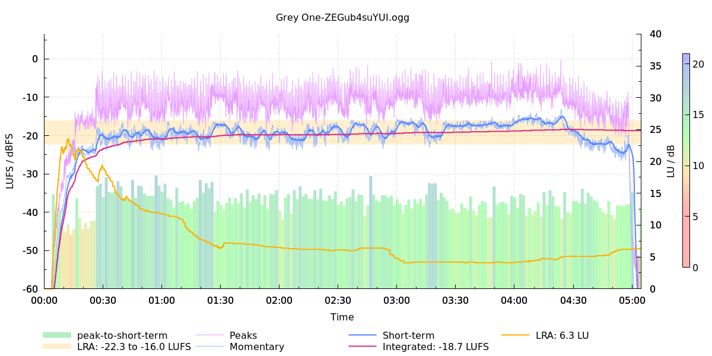
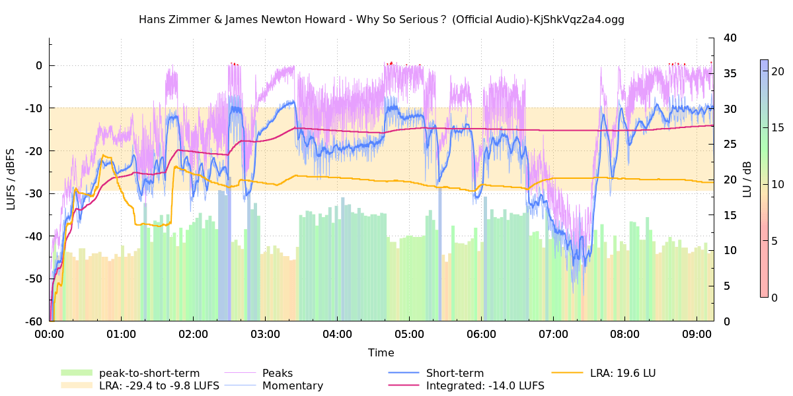

**Table fo Contents**

<div id="user-content-toc">

* [Intro](#intro)
* [Usage](#usage)
* [Examples](#esamples)

</div>

# Intro

The script uses ffmpeg to get loudness data of the input file and then uses
gnuplot to generate a graph and write it to png file.

Peak-to-short-term ratio is calculated as a difference between max peak in a
window and short-term loudness at the end of the window. The size of the window
is calculated so that there are 200 windows in total.

The script is inspired by the ASR thread
[Offline Loudness (LUFS) plotting](https://www.audiosciencereview.com/forum/index.php?threads/offline-loudness-lufs-plotting.19296/),
where L5730 wrote a similar script for PowerShell.

# Usage

```
]$ plot_loudness -h
Usage:
  plot_loudness -i INPUT_FILE [optional arguments]

  Required:
    -i | --input INPUT_FILE     - input file

  Optional:
    -o | --output OUTPUT_FILE   - output file (default is same as input with the
                                  extension changed to "png")
    -f | --force                - force overwrite output file

    -t | --title TITLE          - title (default is "artist / album / title" or
                                  the filename if metadata is not available)
    -s | --size SIZE            - size (default is 1200x600)
    --no-psr                    - don't graph peak-to-short-term ratio

    -h | --help                 - this help message

The script uses ffmpeg to get loudness data of the input file and then uses
gnuplot to generate a graph and write it to png file.

Peak-to-short-term ratio is calculated as a difference between max peak in a
window and short-term loudness at the end of the window. The size of the window
is calculated so that there are 200 windows in total.
```

# Examples

If you listen in youtube's player then keep in mind that it does volume normalization, i.e., it automatically lowers the volume for tracks that have integrated loudness higher than -14 LUFS.

[Adele - Hello](https://www.youtube.com/watch?v=Ei8UnOPJX7w)


[Olivia Rodrigo - Obsessed](https://www.youtube.com/watch?v=QXcjPySjdJU)


[Red Hot Chili Peppers - Californication](https://www.youtube.com/watch?v=YlUKcNNmywk)


[Paper Motion - Grey One](https://www.youtube.com/watch?v=ZEGub4suYUI&list=OLAK5uy_nr6p7xLYSgglUBJxe9rxnWHsMugePFoPo)


[The Dark Knight - Why So Serious?](https://www.youtube.com/watch?v=KjShkVqz2a4)

